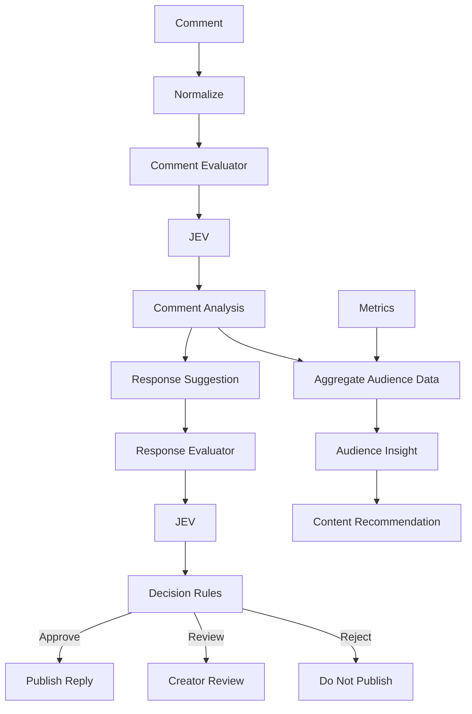

# Intelligence Flow

```mermaid
flowchart TD
    C[Comment] --> N[Normalize]
    N --> E[Comment Evaluator]
    E --> J[JEV]
    J --> CA[Comment Analysis]

    CA --> RS[Response Suggestion]
    RS --> RE[Response Evaluator]
    RE --> J2[JEV]

    J2 --> D[Decision Rules]
    D -->|Approve| PUB[Publish Reply]
    D -->|Review| UI[Creator Review]
    D -->|Reject| END[Do Not Publish]

    CA --> AGG[Aggregate Audience Data]
    MET[Metrics] --> AGG
    AGG --> INS[Audience Insight]
    INS --> REC[Content Recommendation]
```
